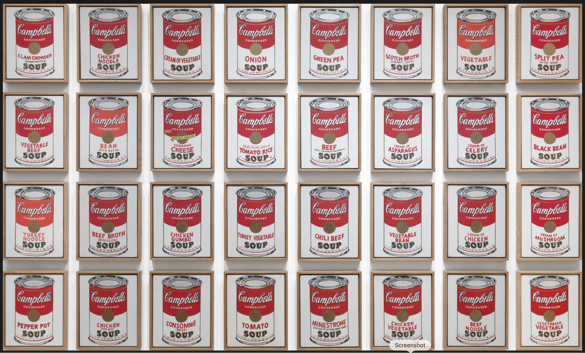
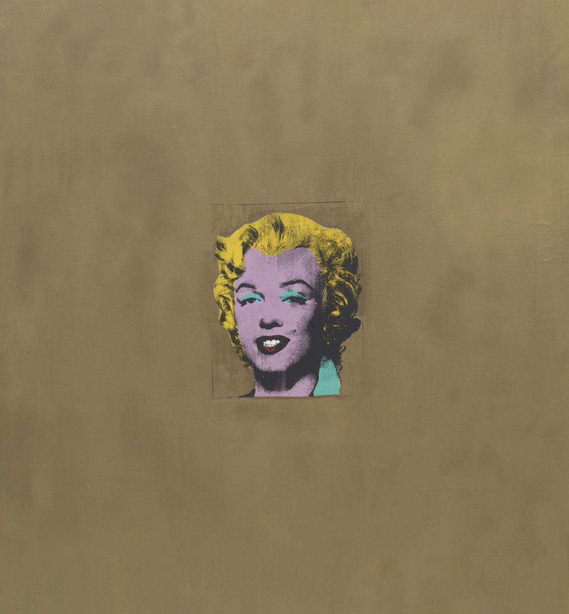
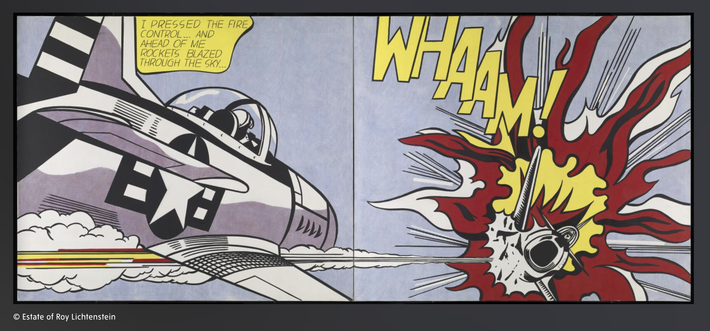
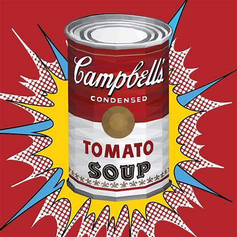
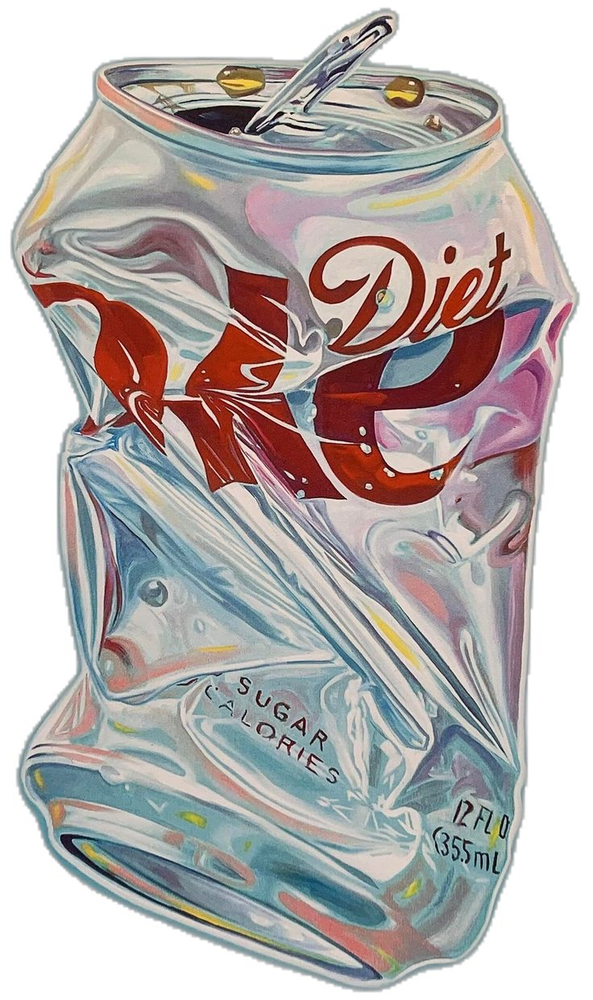

# Quiz9
[](https://www.flickr.com/photos/clairity/20722353368)

---

## GitHub Repository Link

**https://github.com/dwan0480/Quiz9.git**

---

# Part 1: Project Direction

Our team has chosen to **reinterpret an existing artwork**.

We will reinterpret **Andy Warhol’s *Campbell’s Soup Cans* (1962)**. The original work consists of **32 individual canvas panels**, each showing a different Campbell’s soup flavor, arranged in a repeated grid format. MoMA lists the work as acrylic with metallic enamel paint on canvas, with each panel measuring 20 × 16 inches. ([The Museum of Modern Art][1])

**Original artwork image source:** MoMA page for Andy Warhol, *Campbell’s Soup Cans*, 1962. ([The Museum of Modern Art][1])

### Vision statement 

Our project reinterprets Andy Warhol’s *Campbell’s Soup Cans* as an interactive Pop Art system where every can becomes part of a shared animated field. Instead of treating each can as a static consumer object, we will make the entire grid react to sound, time, randomness, and user input at the same time. Our inspiration comes from Warhol’s use of repetition, mass production, and bright commercial imagery in *Campbell’s Soup Cans*, as well as the bold graphic impact of Roy Lichtenstein’s *Whaam!* and its comic-book visual language. ([The Museum of Modern Art][1]) We are also inspired by Warhol’s celebrity silkscreen works, such as *Gold Marilyn Monroe*, which use flat color, repetition, and iconic imagery to turn popular culture into art. ([The Museum of Modern Art][2])

**Inspiration image sources:**

1. MoMA — Andy Warhol, *Campbell’s Soup Cans*, 1962. ([The Museum of Modern Art][1])

2. Tate — Roy Lichtenstein, *Whaam!*, 1963. ([tate museum][3])

3. MoMA — Andy Warhol, *Gold Marilyn Monroe*, 1962. ([The Museum of Modern Art][2])


---

# Part 2: Mechanics

## Team Members and Mechanic Ownership

| Team member     | Mechanic                    |
| --------------- | --------------------------- |
| **[Zane Zhang]**    | **Audio**                 |
| **[Martin Wong]** | **Time-based**              |
| **[Yang Zhang]** | **Perlin Noise and Randomness Mechanic**                    |
| **[Ming Chen]**   |  **User input**                   |

---
## Audio Mechanic — [Zane Zhang]

The audio mechanic uses both volume and frequency content from the sound input to drive changes across the soup-can grid. As the volume becomes louder, the opening of each can expands and the overall can shape grows larger, creating a clear sense of visual swelling and energy. Higher-frequency sounds will cause more noticeable deformation, making the cans appear more distorted, stretched, or vibrated. To enhance the artistic quality of the interaction, small random factors will also be introduced so that the movement does not feel too mechanical or predictable. This means that even when the same sound plays, the cans may respond with slight differences in timing or shape. In this way, audio transforms the originally static Warhol-inspired cans into a lively and expressive visual system that reacts directly to sound.

**Sketch/reference idea:**
```
    Volume ↑ = opening wider + can expands
    Frequency ↑ = stronger deformation
    Random factor = artistic variation
```
The variations can still refer to the Pop Art style, as shown in the figures 


([Morales CarreraAlma Rosa][4])

([Eclectic Posters][5])


## Time-based Mechanic — [Martin Wong]

My mechanic will use timers and timed events to create rhythmic changes across the entire grid of soup cans. Instead of assigning time effects to only one can, the timer system will affect all cans simultaneously, supporting the idea that the whole artwork behaves like one Pop Art machine. Every few seconds, an event will trigger a visual change such as a color palette shift, a label flash, a scale pulse, or a short frame-by-frame transformation. For example, the cans may briefly change from Warhol-inspired red and white into brighter artificial colors, then return to their original state. The user does not need to directly control this mechanic; it works as a repeating visual rhythm in the background. This connects to our project vision because Warhol’s original artwork is based on repetition and mass production, and the timer turns that repetition into movement. The cans become less like separate objects and more like synchronized products on a factory line, advertising display, or animated pop-culture screen.

**Sketch/reference idea:**
A grid of Campbell’s-style cans with arrows showing timed color changes every 3–5 seconds. Label the states as:
`Normal palette → Flash palette → Scale pulse → Label flicker → Return to normal`

## Perlin Noise and Randomness Mechanic — [Yang Zhang]
My mechanic will use Perlin noise and randomness to create natural variation across the repeated soup-can grid. Andy Warhol’s Campbell’s Soup Cans is based on repetition, with 32 panels arranged as a repeated commercial image; MoMA describes the original work as 32 canvas panels, each measuring 20 × 16 inches. In our reinterpretation, I want to keep this repeated Pop Art structure, but make it feel less static and more alive.
Perlin noise will be used to control subtle, smooth changes in each can, such as small label waves, liquid movement, background texture, and gentle distortion of the can outline. Unlike pure random movement, Perlin noise creates smoother organic motion, so the cans will appear to breathe, ripple, or shift naturally rather than shake randomly. Randomness will be used for smaller visual variations, such as choosing different colour accents, changing the timing of some cans, or slightly altering the amount of distortion on each can. The p5.js noise() function is suitable for this because it returns values between 0 and 1 and can generate smooth variation over time. The noiseSeed() function can also make the noise pattern repeatable if we want a consistent visual result each time the sketch runs.
This mechanic connects with the audio and time-based mechanics by adding variation to their effects. For example, when the audio makes the cans expand, Perlin noise can make each can deform slightly differently. When the timer triggers a colour change, randomness can decide which cans change first. It also connects with user input because clicking or hovering over a can could increase its noise intensity, making that can look more unstable or animated. Overall, this mechanic helps transform Warhol’s repeated soup cans into a dynamic Pop Art system where every can belongs to the same grid but still has its own animated behaviour.

**Sketch/reference idea:**
```
    Perlin noise = smooth label waves / liquid movement / organic distortion

    Randomness = colour accents / timing variation / different distortion strength

    Audio + noise = cans expand, but each one moves slightly differently

    Timer + randomness = cans change colour in a less predictable sequence

    User input + noise = selected can becomes more unstable or animated
```

## User input Mechanic — [Ming Chen]

My interaction mechanisms are based on user input, primarily using the mouse and keyboard, allowing viewers to directly intervene in and control the soup can grid. In the complete work, the cans will change automatically via a time-based mechanism, but user input adds a layer of more active interaction. When a user moves the mouse across the canvas, cans near the cursor can grow larger, rotate slightly, or change color. This creates the sense that the repeated commercial images are responding to the viewer's attention. When a user clicks on a can, the can can open and pour out liquid. Keyboard input can also switch between different pop-art color schemes, such as Warhol’s red-and-white mode, a comic-book palette, or a brighter celebrity silkscreen style. By incorporating user input, viewers are no longer just watching those repetitive, static cans. They can interrupt, alter, and interact with the grid. This transforms the static pop art image into an interactive piece. The audience's interactions become part of the work.

**Sketch/reference idea:**
```
    A[User moves mouse on canvas] --> B[Detect nearby soup cans]
    B --> C[Cans enlarge, rotate, or change colour]

    D[User clicks a soup can] --> E[Selected can opens]
    E --> F[Liquid pours out as a short animation]

    G[User presses keyboard] --> H[Switch Pop Art colour mode]
    H --> I[Apply new colour palette to the full grid]
```

---

# Part 3: Putting It Together 

All four mechanics will affect the full soup-can grid at the same time, rather than assigning one mechanic to one can. The cans will share one canvas and remain visually unified through repeated layout, bold outlines, flat colors, and Pop Art-inspired typography. Audio will drive reactive movement or intensity, time-based events will create rhythmic changes, Perlin noise and randomness will introduce variation, and user input will allow direct interaction. Together, these systems will transform Warhol’s static repetition into a living Pop Art display.

---

# Resources

[1] The Museum of Modern Art. (n.d.). *Andy Warhol. Campbell’s Soup Cans. 1962*. MoMA.  
https://www.moma.org/collection/works/79809

[2] The Museum of Modern Art. (n.d.). *Andy Warhol. Gold Marilyn Monroe. 1962*. MoMA.  
https://www.moma.org/collection/works/79737

[3] Tate. (n.d.). *‘Whaam!’, Roy Lichtenstein, 1963*. Tate.  
https://www.tate.org.uk/art/artworks/lichtenstein-whaam-t00897

[4] Morales Carrera, A. R. (n.d.). *Pop Art soup can reference image*. Pinterest.  
https://au.pinterest.com/pin/213639576066538015/

[5] Eclectic Posters. (n.d.). *Pop Art can reference image*. Pinterest.  
https://au.pinterest.com/pin/492649954927666/
